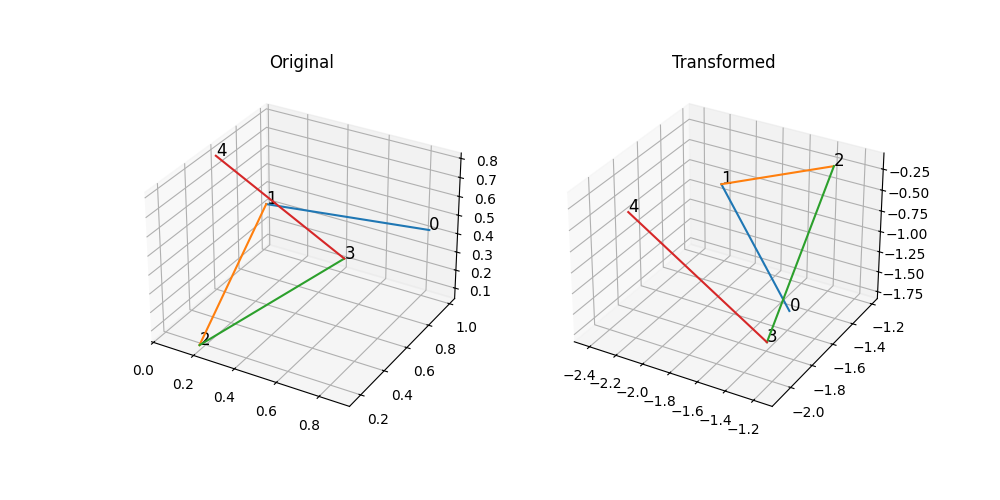
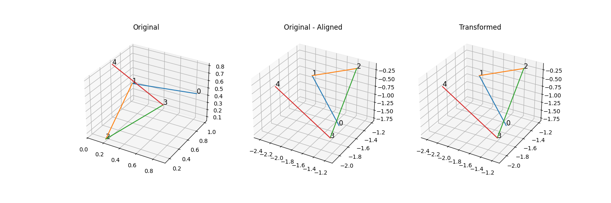

# Procrustes Alignment


```python
%matplotlib ipympl
import numpy as np
import matplotlib.pyplot as plt
from scipy.spatial.transform import Rotation
```

## Random data generation and visualization


```python
x = np.random.rand(5, 3)
```

### Rigid Transform
$$
\mathbf{y} = (\mathbf{x} \cdot R) \times s + t
$$


```python
def rigid_transform(x):
    rot_mat = Rotation.random().as_matrix()
    scale = np.random.uniform(0, 2)
    translation = np.random.uniform(-2, 2, 3)
    y = ((x @ rot_mat) * scale) + translation
    return y, rot_mat, scale, translation
```


```python
y, rot_mat, scale, translation = rigid_transform(x)
```


```python
def plot_rigid_transform(point_clouds, titles=None):
    fig = plt.figure(figsize=(5 * len(point_clouds), 5))

    if titles is None:
        titles = [""] * len(point_clouds)

    axes = [fig.add_subplot(1, len(point_clouds), i + 1, projection='3d') for i in range(len(point_clouds))]
    
    for subplot_idx, (sample, subplot, title) in enumerate(zip(point_clouds, axes, titles)):

        subplot.set_title(title)

        for i in range(sample.shape[0]):
            subplot.text(sample[i,0],sample[i,1],sample[i,2],  '%s' % (str(i)), size=12, zorder=1, color='k')

        for i in range(sample.shape[0] - 1):
            subplot.plot([sample[i][0], sample[i+1][0]], [sample[i][1], sample[i+1][1]], [sample[i][2], sample[i+1][2]])

    plt.show()
```


```python
plot_rigid_transform([x, y], titles=["Original", "Transformed"])
```


<div style="display: inline-block;">
    <div class="jupyter-widgets widget-label" style="text-align: center;">
        Figure
    </div>
    
</div>


## Estimation

### Cross-Covariance Matrix
$$
CrossCov(x,y) = E[(x - mu_x)^T \cdot (y - mu_y)]
$$

### Rotation Matrix
SVD of the cross-covariance matrix gives the $U$, $S$, $V$.

$$
RotationMatrix = U \times V
$$

$S$ will be utilized below in the scale calculation.


```python
def calculate_cross_cov_mat(x, y):
    mu_x = np.mean(x, axis=0)
    mu_y = np.mean(y, axis=0)
    return np.dot((x - mu_x).T, (y - mu_y))

def calculate_rot_mat(x, y):
    cross_cov_mat = calculate_cross_cov_mat(x, y)
    u, singular_vals, v = np.linalg.svd(cross_cov_mat)
    rot_mat = np.dot(u, v)
    return rot_mat, singular_vals

rot_mat_hat, singular_vals = calculate_rot_mat(x, y)
```

### Scale
$$
Scale = \frac{\sum_{i}^{n} S_i}{\|x - \mu_x\|^2}
$$


```python
def calculate_scale(x, singular_vals):
    return np.sum(singular_vals) / (np.linalg.norm(x - x.mean(axis=0), ord="fro") ** 2)

scale_hat = calculate_scale(x - x.mean(axis=0), singular_vals=singular_vals)
```

### Translation

$$
Translation = \mu_y - \mu_x
$$


```python
def calculate_translation(x, y, rot_mat=None, scale=None):

    if rot_mat is not None:
        x = np.dot(x, rot_mat)
    if scale is not None:
        x = x * scale

    # Translation is the difference between centroids
    x_centroid = np.mean(x, axis=0)
    y_centroid = np.mean(y, axis=0)
    
    return y_centroid - x_centroid

translation_hat = calculate_translation(x, y, rot_mat=rot_mat_hat, scale=scale_hat)
```

## Results


```python
plot_rigid_transform([x, (x @ rot_mat_hat) * scale_hat + translation_hat, y], titles=["Original", "Original - Aligned", "Transformed"])
```


<div style="display: inline-block;">
    <div class="jupyter-widgets widget-label" style="text-align: center;">
        Figure
    </div>
    
</div>


### Numerical Analysis

As you can see, the error between the estimated rotation matrix and the original rotation matrix is negligible (smaller then $1^{-15}$), suggesting that the rotation matrix estimation is accurate. Similarly, the error between the estimated scale factor and the original scale factor is also negligible (smaller then $1^{-15}$), indicating that the estimation process was successful. These error most likely originated from the numerical precision of the calculations, which is inherent to floating-point arithmetic.


```python
print("Rotation Matrix:")
print(rot_mat)
print()

print("Estimated Rotation Matrix:")
print(rot_mat_hat)
print()

print("Difference between Estimated and Original Rotation Matrices:")
print(np.abs(rot_mat - rot_mat_hat))
```

    Rotation Matrix:
    [[ 0.30341177  0.62423974 -0.71990696]
     [ 0.09199302 -0.77118364 -0.629931  ]
     [-0.94840845  0.12490207 -0.2914119 ]]
    
    Estimated Rotation Matrix:
    [[ 0.30341177  0.62423974 -0.71990696]
     [ 0.09199302 -0.77118364 -0.629931  ]
     [-0.94840845  0.12490207 -0.2914119 ]]
    
    Difference between Estimated and Original Rotation Matrices:
    [[0.00000000e+00 1.11022302e-16 0.00000000e+00]
     [2.77555756e-17 5.55111512e-16 5.55111512e-16]
     [1.11022302e-16 6.93889390e-17 3.88578059e-16]]


```python
print(f"{scale=}, {scale_hat=}")
print()

print("Difference between Estimated and Original scales:")
print(np.abs(scale - scale_hat))
```

    scale=1.5791399846533527, scale_hat=np.float64(1.579139984653353)
    
    Difference between Estimated and Original scales:
    2.220446049250313e-16


```python
print(f"{translation=}, {translation_hat=}")
print()

print("Difference between Estimated and Original translations:")
print(np.abs(translation - translation_hat))
```

    translation=array([-1.31184479, -1.33850253,  0.31393771]), translation_hat=array([-1.31184479, -1.33850253,  0.31393771])
    
    Difference between Estimated and Original translations:
    [4.44089210e-16 4.44089210e-16 7.77156117e-16]

